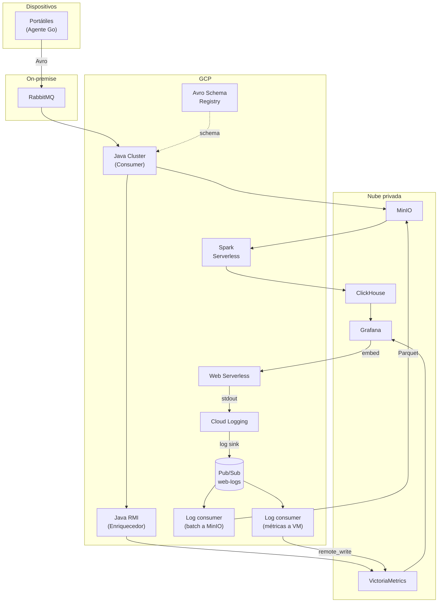
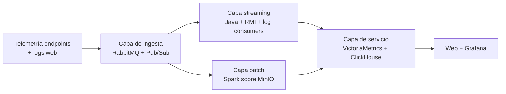
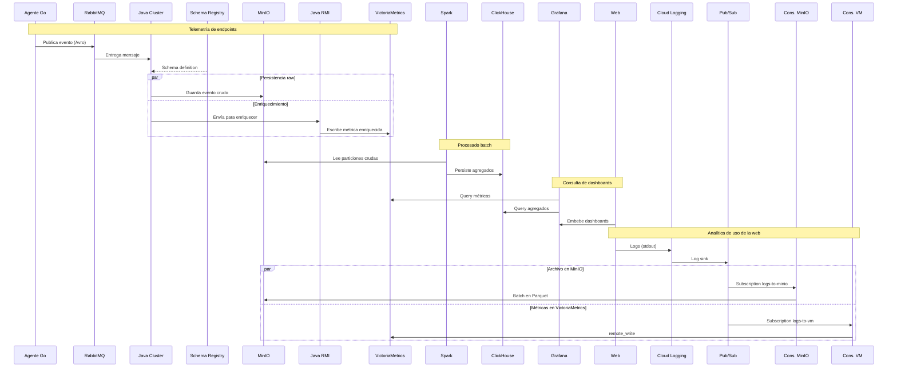
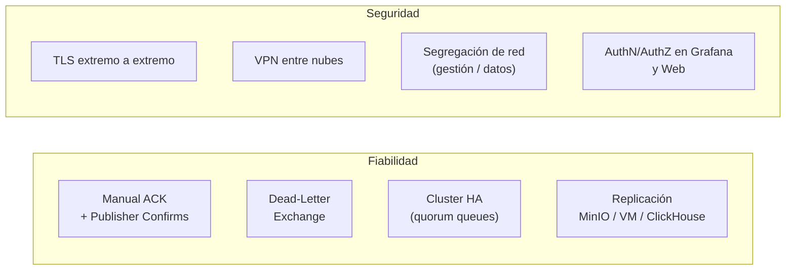

# Sistema de telemetría de portátiles corporativos

Plataforma para recolectar, procesar y visualizar datos de uso de los portátiles de la empresa. Combina ingesta en streaming desde los endpoints, procesado batch sobre el histórico almacenado en object storage, y una capa de servicio que alimenta dashboards embebidos en una web corporativa.

## Arquitectura general

La solución vive en cuatro entornos distintos: el agente corre en cada portátil, la cola de ingesta vive on-premise, el procesado está en GCP y los almacenes de datos en una nube privada.

## Capas de la arquitectura de datos

Sigue un patrón Lambda. La capa de ingesta unifica la entrada de datos; la capa batch trabaja sobre MinIO con Spark; la capa streaming pasa por el consumer Java y el enriquecedor RMI; y la capa de servicio expone los resultados vía VictoriaMetrics y ClickHouse a Grafana.

## Flujo de datos

## Componentes por zona

### Dispositivos

**Agente Go.** Binario único embarcado en los portátiles corporativos. Recolecta telemetría de uso (procesos, recursos, sesiones, errores), la serializa en Avro y la publica en RabbitMQ.

### On-premise

**RabbitMQ.** Broker AMQP que actúa como punto de entrada de toda la telemetría. Vive on-premise porque los agentes publican contra la red corporativa; desde ahí los datos cruzan a GCP por VPN.

### GCP

**Avro Schema Registry.** Centraliza la definición de schemas. Productor y consumer comparten contrato sin acoplarse a una versión hardcoded, y permite evolución de esquemas con compatibilidad controlada.

**Java Cluster (Consumer).** Suscriptor de la cola de RabbitMQ. Cada mensaje recibido se persiste en bruto en MinIO y se reenvía al clúster RMI para ser enriquecido.

**Java RMI (Enriquecedor).** Clúster que recibe los eventos del consumer, los enriquece (catálogo de dispositivos, usuario, departamento, normalización de campos) y escribe la métrica resultante en VictoriaMetrics.

**Spark Serverless.** Job batch que recorre MinIO en ventanas periódicas y calcula los agregados que alimentan los dashboards históricos (consumo medio por departamento, top de aplicaciones, evolución semanal, etc.).

**Web Serverless.** Frontend de la plataforma. Embebe los dashboards de Grafana y expone una API para visualizar los datos a usuarios autorizados.

**Cloud Logging.** Recoge automáticamente el `stdout`/`stderr` de la web serverless. Un *log sink* con filtro reenvía los eventos relevantes a un topic de Pub/Sub, sin que el código de la web tenga que conocer la cola.

**Pub/Sub.** Topic central para los logs de la web. Una sola publicación se distribuye en dos *subscriptions* independientes, cada una con su consumidor, su ACK y su dead-letter. Si una rama falla, la otra sigue ingiriendo.

**Log consumer (batch a MinIO).** Suscriptor *pull*. Acumula mensajes (≈1000 mensajes o 60s, lo que ocurra antes), los serializa como Parquet comprimido y los sube a MinIO en un layout particionado por fecha (`web-logs/year=.../month=.../day=.../hour=...`) listo para que Spark los lea.

**Log consumer (métricas a VictoriaMetrics).** Suscriptor *pull*. Parsea cada log, extrae métricas estructuradas (`web_requests_total`, `web_request_duration_seconds`, `web_errors_total`, etc.) y las envía a VictoriaMetrics vía `remote_write`. Los identificadores de alta cardinalidad (`request_id`, `user_id`) se quedan en MinIO; a VictoriaMetrics solo van labels acotados.

### Nube privada

**MinIO.** Almacenamiento de objetos compatible con S3. Guarda los eventos en bruto particionados por fecha, listos para que Spark los procese.

**VictoriaMetrics.** Base de datos de series temporales. Recibe las escrituras del clúster RMI (telemetría enriquecida) y del *log consumer* de métricas (analítica web), y sirve dashboards near-real-time a Grafana.

**ClickHouse.** Base de datos columnar OLAP. Guarda los agregados producidos por Spark y los expone a Grafana para queries ad-hoc sobre el histórico.

**Grafana.** Capa de visualización. Conecta a VictoriaMetrics y ClickHouse, y se embebe en la web serverless.

## Justificación de tecnologías

### Ingesta y serialización

**RabbitMQ + Avro.** RabbitMQ es un broker AMQP maduro, con cluster HA (quorum queues), ACK manual, dead-letter exchange y soporte TLS nativo: todo lo necesario para garantizar fiabilidad en el tránsito de datos críticos. Avro aporta tipado fuerte, schema evolution, compresión binaria (≈5-10× menor que JSON) y un registry centralizado.

**Pub/Sub con fan-out a dos destinos.** Para los logs de la web no compensa montar otro RabbitMQ ni acoplar el frontend a la red privada. Pub/Sub es gestionado, escala sin operación y aporta una propiedad clave: un mismo topic con múltiples *subscriptions* entrega copias independientes a cada consumidor. Eso permite que el log se archive en MinIO (capa batch) y se convierta en métricas para VictoriaMetrics (capa de servicio) sin acoplar ambos caminos. Los logs cruzan a la nube privada en dos formatos: bruto comprimido y métricas agregadas, cada uno con su retención y su coste óptimo.

### Procesado

**Java Cluster como consumer.** El bloque de consumo tiene que aguantar picos con backpressure y reentregar mensajes en caso de fallo. Un consumidor Java con `prefetch_count` ajustable y ACK manual es el patrón estándar.

**Java RMI para enriquecimiento.** RMI permite repartir el trabajo de enriquecimiento entre un número variable de nodos manteniendo la semántica de llamada a método. Es la pieza más fácil de escalar horizontalmente cuando el cuello de botella es CPU o lookup de catálogo.

**Spark Serverless.** Procesa el histórico en MinIO sin gestionar cluster. El modelo *pay per job* encaja con cargas batch periódicas y permite paralelización masiva puntual sin coste fijo.

### Almacenamiento

Tres sistemas de almacenamiento masivo, cada uno especializado en una forma de acceso:

| Sistema | Modelo | Rol |
|---|---|---|
| MinIO | Object storage | Raw events, fuente única de la verdad |
| VictoriaMetrics | Series temporales | Métricas near-real-time |
| ClickHouse | Columnar OLAP | Agregados históricos para dashboards |

**MinIO** se elige por ser S3-compatible, autohospedable (encaja con la nube privada), y por desplegarse en cluster distribuido con replicación y erasure coding.

**VictoriaMetrics** sobre Prometheus por mejor compresión, mayor rendimiento de queries y soporte nativo de cluster. Habla PromQL, así que Grafana lo consume sin fricción.

**ClickHouse** sustituye la elección habitual de Cassandra. El patrón de consulta de Grafana es OLAP (agregaciones con filtros arbitrarios), no key-value; ClickHouse barre solo las columnas implicadas, comprime ~10×, habla SQL estándar y tiene plugin oficial de Grafana. Operativamente es más simple que un ring de Cassandra. Cassandra brillaría si las queries fueran fijas por *partition key*, pero los dashboards exploratorios son justo lo contrario.

### Visualización y frontend

**Grafana** es estándar de facto para series temporales y tiene drivers maduros tanto para VictoriaMetrics (PromQL) como para ClickHouse (SQL).

**Web serverless** porque el frontend tiene tráfico variable (picos en horario de oficina, plano por la noche) y no justifica máquinas dedicadas. Cloud Run o equivalente escala a cero fuera de horario.

## Fiabilidad y seguridad

- **TLS** entre el agente Go y RabbitMQ, y entre RabbitMQ y el consumer Java.
- **Manual ACK** en el consumer: los mensajes solo se confirman tras persistir en MinIO y reenviar al RMI.
- **Publisher confirms** en el agente para garantizar entrega.
- **Dead-Letter Exchange** para mensajes que no se puedan procesar o deserializar.
- **Cluster HA** en RabbitMQ; replicación en MinIO, VictoriaMetrics y ClickHouse.
- **VPN** entre on-premise, GCP y nube privada.
- **Segregación de red** en cada nube: red de gestión y red de datos separadas, cada una con un propósito justificado.

## Operación e infraestructura

- **IaC unificado** (Terraform) que despliega los recursos de las tres nubes desde un mismo proyecto y host de control.
- **Configuración automatizada** (Ansible) para hosts y servicios.
- **Registro de contenedores** en cada una de las tres nubes.
- **Aplicaciones contenedorizadas** en todas las capas para garantizar reproducibilidad y portabilidad.