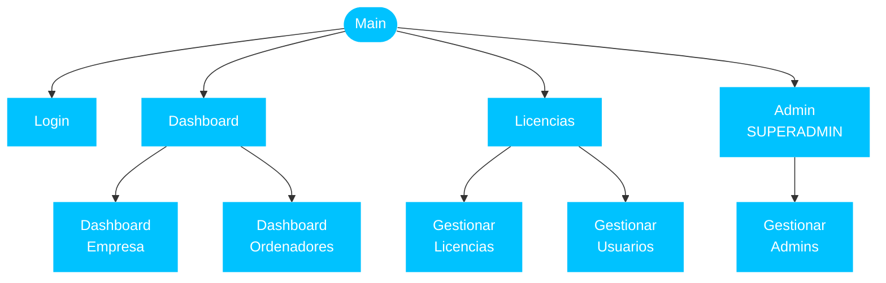

# Nabigazio Fluxua – WebHardMon

```mermaid
graph TD
    Main([Main])

    Main --> Login[Login]
    Main --> Dashboard[Dashboard]
    Main --> Licencias[Licencias]
    Main --> Admin[Admin\nSUPERADMIN]

    Dashboard --> DashEmpresa[Dashboard\nEmpresa]
    Dashboard --> DashOrdenadores[Dashboard\nOrdenadores]

    Licencias --> GestLicencias[Gestionar\nLicencias]
    Licencias --> GestUsuarios[Gestionar\nUsuarios]

    Admin --> GestAdmins[Gestionar\nAdmins]

    style Main fill:#00C2FF,color:#fff,stroke:none
    style Login fill:#00C2FF,color:#fff,stroke:none
    style Dashboard fill:#00C2FF,color:#fff,stroke:none
    style Licencias fill:#00C2FF,color:#fff,stroke:none
    style Admin fill:#00C2FF,color:#fff,stroke:none
    style DashEmpresa fill:#00C2FF,color:#fff,stroke:none
    style DashOrdenadores fill:#00C2FF,color:#fff,stroke:none
    style GestLicencias fill:#00C2FF,color:#fff,stroke:none
    style GestUsuarios fill:#00C2FF,color:#fff,stroke:none
    style GestAdmins fill:#00C2FF,color:#fff,stroke:none
```
